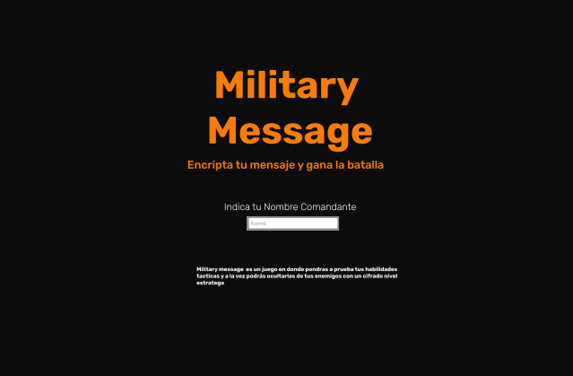

# Military Message
## **Military message** es un juego en donde pondrás a prueba tus habilidades tácticas y a la vez podrás ocultarlas de tus enemigos con un cifrado nivel estratega

 

## Sé de los primeros en probar <b>Military Message</b>
##### [Este es el enlace directo a la app](https://isisag.github.io/SCL019-cipher/src/index.html).

Puedes probarla y usar su funcionalidad. Recuerda que <b>Military Message</b> aun se encuentra en desarrollo por lo que tu feedback es un importante para mejorar sus implementaciones.

##### ***Tu feedback es el mejor regalo ❤***

### ❤ Para ti, Querido Usuario ❤

 El desarrollo de <b>Military Message</b> fue pensado para un usuario adulto joven aficionado a lo histórico, pero sin dejar de lado la modernidad que pueden ofrecernos las interfaces hoy en día, es alguien que no tiene miedo a atreverse además de estar familiarizado con nuevas tecnologías.
 
Las decisiones en diseño fueron altamente inspiradas en este deseo de atreverse, pero a la vez conservar lo clásico al tomar una paleta de colores basada en arte romano antiguo.
 
Adema de aportarle un carácter lúdico con la parte de la estrategia bélica, <b>Military Message</b> puede ser ocupado para crear contraseñas o cifrar mensajes de la vida cotidiana.

### Interfaz <b>Military Message</b>

#### ¡Revisa en corazón de la interfaz en el Figma del Proyecto!
[Military Message Figma File](https://www.figma.com/file/Qo3WbwJRMM938gr0JTuKaR/Military-Message).

